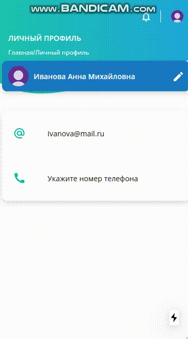

Для работы с проектом, следует его скачать и в терминале прописать:

npm install

npm run dev

Тестовое задание для одной из компании. 

Для задачи использовалось NextJS + React + Material UI.

1. Верстка 

2. Отправка данных post-запросом.

3. Запись данных в localStorage. 

Также применил библиотеку axios.

Как это выглядит на компьютере: 

Как это выглядит на мобильной версии:

